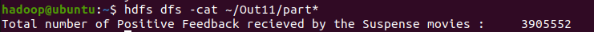

# Hadoop 
Documentation for the Hadoop Part of the internals for Big Data lab 6th sem

Name : Mukund.G   
USN : 1NT19IS417   
Batch : B3   

## Output Screenshots:

- Count the number of referrable movies from the dataset.

- Find the Total number of positive feedbacks for the movie category “Suspense” 

